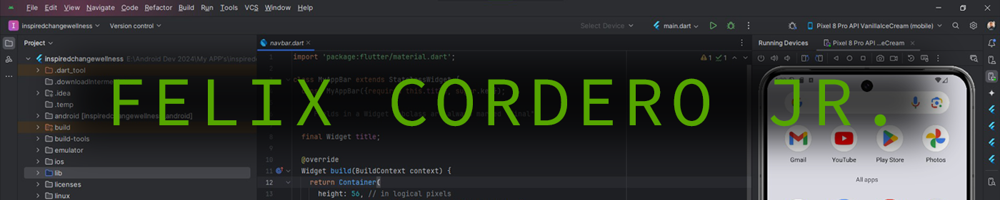
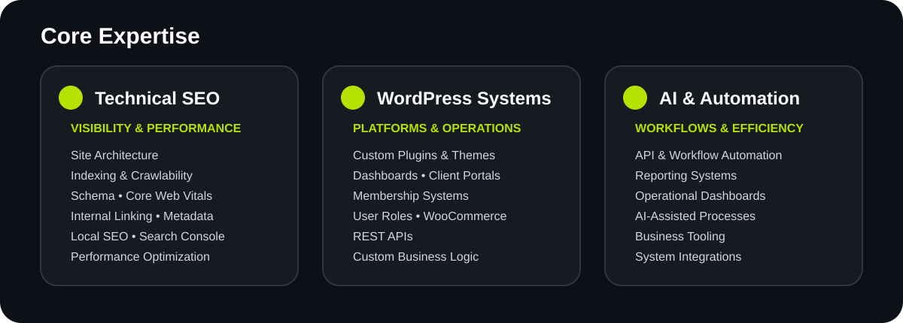
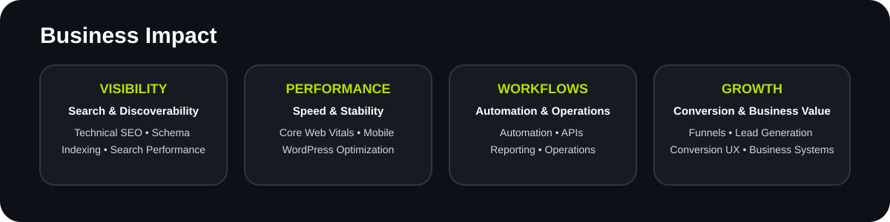
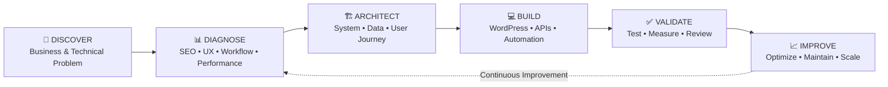

 

### Web & WordPress Systems Developer | Technical SEO | AI Automation

**Building digital systems for better visibility, performance, workflows, and business operations.**

 

 

### [ABOUT](#felix-about) • [EXPERTISE](#felix-expertise) • [SYSTEMS](#felix-systems) • [WORKFLOW](#felix-workflow) • [STACK](#felix-stack) • [CONTACT](#felix-contact)

---

## About Me

<table>
<tr>
<td width="65%" valign="top">

I build and improve **WordPress systems, Technical SEO foundations, custom functionality, dashboards, funnels, client portals, and automation-ready workflows**.

My work goes beyond building websites.

I focus on how digital systems:

- perform technically
- support business operations
- communicate clearly with search engines
- guide users through conversion paths
- integrate with workflows and APIs
- remain maintainable as they grow

I work with businesses, entrepreneurs, startups, and agencies that need more than a standard website.

They need a **structured digital system designed to solve a real business problem**.

</td>

<td width="35%" align="center" valign="middle">

### 7+ YEARS

**Web Systems Experience**

 

### 3 CORE PILLARS

Technical SEO  
WordPress Systems  
AI Automation

 

### REMOTE

Philippines

</td>
</tr>
</table>

---

---

---

## Selected Systems

### Representative, anonymized, and independent systems

<table>
<tr>
<td width="50%" valign="top">

### SEO Operations System

**Problem**

SEO execution can become fragmented across pages, keywords, technical issues, reporting, and priorities.

**System**

Centralized operational workflow for:

`Technical SEO` `Page Audits` `Keywords` `Priorities` `Reporting`

**Business Value**

Improves visibility into SEO execution, priorities, progress, and technical health.

</td>

<td width="50%" valign="top">

### Membership Platform System

**Problem**

Subscription platforms require controlled access, user interaction, permissions, messaging, and account logic.

**System**

Structured WordPress platform supporting:

`Membership Logic` `Profiles` `Messaging` `Permissions` `Filtering`

**Business Value**

Provides a scalable foundation for subscription-based digital services.

</td>
</tr>

<tr>
<td width="50%" valign="top">

### Business Growth System

**Problem**

Business information, leads, workflows, reporting, and website operations often exist across disconnected tools.

**System**

Operational interface connecting:

`Dashboards` `Lead Workflows` `Reporting` `Automation` `Website Operations`

**Business Value**

Improves operational visibility and reduces fragmented workflows.

</td>

<td width="50%" valign="top">

### Portfolio Operations System

**Problem**

Traditional portfolios display work but rarely operate as structured professional systems.

**System**

Professional platform connecting:

`Portfolio` `Services` `Case Studies` `Lead Capture` `Automation`

**Business Value**

Turns a portfolio into a structured professional and lead-generation system.

</td>
</tr>
</table>

> Selected client work is intentionally anonymized or presented as representative systems to protect confidentiality.

---

## Systems Workflow

### Problem → Diagnosis → Architecture → Build → Validate → Improve

<table>
<tr>
<td align="center" width="33%">

### MAINTAINABILITY

Systems should remain understandable and manageable as they grow.

</td>

<td align="center" width="33%">

### PERFORMANCE

Speed and technical health are part of the architecture.

</td>

<td align="center" width="33%">

### SECURITY

Access, data, and integrations require controlled design.

</td>
</tr>

<tr>
<td align="center" width="33%">

### SCALABILITY

Architecture should support future requirements.

</td>

<td align="center" width="33%">

### DOCUMENTATION

Systems should be understandable and maintainable over time.

</td>

<td align="center" width="33%">

### BUSINESS VALUE

Technology should solve a meaningful business problem.

</td>
</tr>
</table>

---

## Technology Stack

### Core Development

 

  

### WordPress Systems

  

### Technical SEO & Performance

  

### Workflow & Engineering Tools

---

## Current Development Direction

<table>
<tr>
<td width="50%" valign="top">

### ⚙️ Web Systems

WordPress Architecture  
Custom Plugin Development  
Business Dashboards  
Client Portals  
Membership Platforms  
Internal Business Tools

</td>

<td width="50%" valign="top">

### 🤖 Automation & Intelligence

AI-Assisted Workflows  
Workflow Automation  
API Integrations  
Reporting Architecture  
Technical SEO Operations  
Modular Software Systems

</td>
</tr>
</table>

---

## AI Product Strategy

AI should be part of the system architecture, not simply added as a feature.

<table>
<tr>
<td width="25%" align="center">

### USERS

Guidance  
Search  
Assistance

</td>

<td width="25%" align="center">

### CLIENTS

Reporting  
Insights  
Support

</td>

<td width="25%" align="center">

### ADMINS

Operations  
Monitoring  
Workflows

</td>

<td width="25%" align="center">

### DEVELOPERS

Documentation  
Diagnostics  
Maintenance

</td>
</tr>
</table>

AI access should remain bounded by permissions, privacy, approved data sources, security controls, and human oversight.

---

## Client Protection

### PRIVATE BY DEFAULT • CONTROLLED DISCLOSURE • PROFESSIONAL CONFIDENTIALITY

Client-identifying code, URLs, credentials, screenshots, private systems, and protected implementation details are not publicly distributed.

Public repositories focus on:

`Independent Projects` • `Technical Demonstrations` • `Reusable Components` • `Sanitized Examples` • `R&D Systems`

---

## GitHub Activity

  

---

## Engineering Philosophy

### GOOD SYSTEMS CREATE CLARITY

A strong system should make information easier to understand,  
workflows easier to operate,  
problems easier to identify,  
and improvements easier to execute.

 

**Technology should support the business, not complicate it.**

---

## Contact

### Have a website, SEO, workflow, or systems challenge?

**Let's identify the real problem first, then determine the right system to build.**

 

 

---

## FROM IDEAS TO IMPACT

### WEB SYSTEMS • TECHNICAL SEO • WORDPRESS • AI AUTOMATION

**Systems for better visibility, workflows, performance, and operational clarity.**

 

**Felix Cordero Jr.**

Web & WordPress Systems Developer | Technical SEO | AI Automation

 

